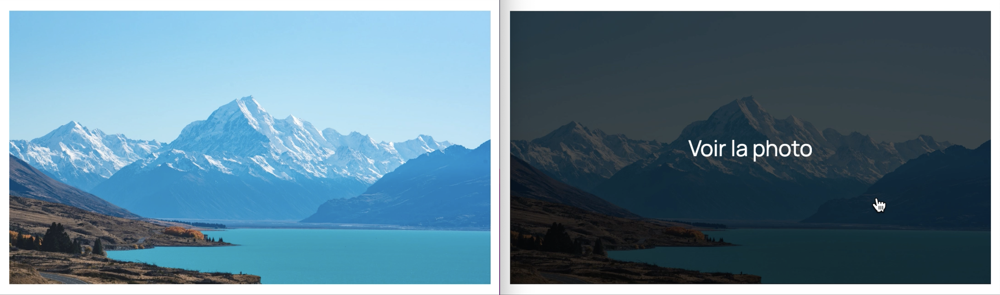

# Site HTML5 et CSS3 du site de la photographe Robbie Lens - step14

## Abordez d'autres techniques de mise en page

Vous allez maintenant pouvoir exploiter ce que vous venez d'apprendre dans le portfolio de Robbie Lens. Les images de la page "Portfolio" peuvent maintenant s'afficher en plein écran avec la méthode vue dans le chapitre “Insérez des images”. Pour cela, des liens ont été ajoutés avec la classe lien-conteneur-photo .

Vous pouvez retrouver sur GitHub la base de code pour faire l'exercice sur la <a href="https://github.com/OpenClassrooms-Student-Center/1603881-creez-votre-site-web-avec-html5-et-css3/archive/refs/heads/P3C5-solution.zip">branche P3C5-exercice</a>.

Pour ce chapitre, vous allez :

- transformer les liens qui ont la classe `.cta` en éléments `inline-block` avec `display` sur les pages "Accueil" et "À propos", et ajouter leur lien vers la page "Portfolio" ; (`cta` veut dire `call to action` en anglais, autrement dit, en français : "bouton d'appel à l'action")

- ajouter des `margin` et `padding` là où il en manque sur les pages "Accueil" et "À propos" (pour rappel, voici la maquette d'inspiration pour le site)

- créer sur les images un effet au survol de la souris en affichant un élément (grâce à `display` ) qui :

  - aura un fond noir d'une opacité de 70% ;
  - s'affichera par-dessus l'image, et y mentionnera le texte suivant : "Voir la photo", comme ceci :

## Etape suivante

Dans l'<a href="https://github.com/GregLeBarbar/html-css-robbie-lens/tree/step15">étape suivante</a> nous allons "Ajoutez des tableaux".
