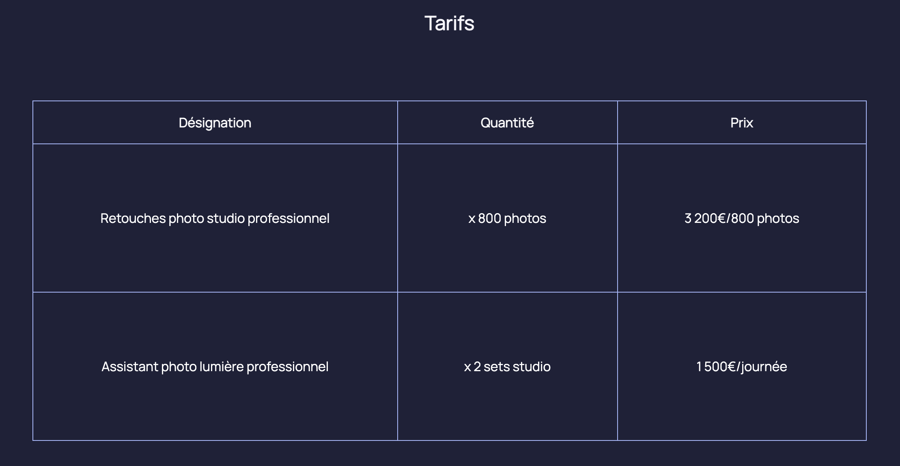

# Site HTML5 et CSS3 du site de la photographe Robbie Lens - step15

## Ajoutez des tableaux

Vous allez maintenant pouvoir construire le tableau des tarifs de Robbie Lens !

Vous verrez que la base de code a été réorganisée :

- le fichier CSS a été découpé en 4 fichiers CSS différents qui se trouvent dans le dossier `style`

- le fichier de base `style.css` est importé par chaque page

- chaque page possède son propre fichier CSS.

Vous ajouterez les tarifs à la suite de la page "À propos", après le lien `Call to action` (appel à l’action).

Voilà à quoi le tableau devrait ressembler :

## Etape suivante

Dans l'<a href="https://github.com/GregLeBarbar/html-css-robbie-lens/tree/step16">étape suivante</a> nous allons "Créez des formulaires".
